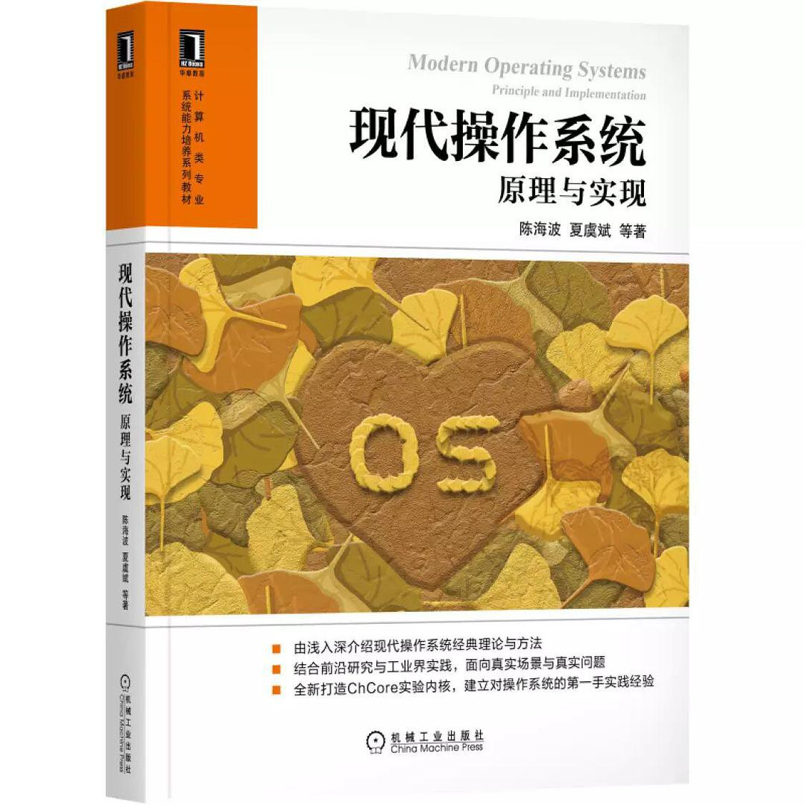

# 【操作系统最佳实践】MIT 6.828 JOS与NJU ICS NEMU源码精读

怕太长不看系列：

[我做的MIT 6.828课程笔记](http://knowledgehive.github.io/6.828/)

如果觉得有帮助的话请star一波吧~

如果有错误欢迎指正PR，有任何问题欢迎提问。

__________

在选择计算机专业的时候，哪一个男孩没有过做游戏的梦想？

下面gif是NJU NEMU运行的《仙剑奇侠传》游戏。

虽然距离真正的游戏制作还非常的遥远，但令人兴奋的是，如果我们完整的学习真个系统，我们掌握到的技术远比游戏开发技术更加的广泛和深刻。

俗话说，理科生/工科生更能接近这个世界运作的真相。那么，作为一个程序员，如何去理解一个软件世界的本质呢？

所以，我来安利大家学习操作系统了。

______

## MIT 6.828 JOS

首先需要安利的课程就是MIT 6.828这门课程操作系统课程。

我们学习的材料是2018年的，这门课主要围绕着JOS和xv6系统进行展开，但是最主要核心系统是JOS。

[MIT 6.828 2018课程主页](https://pdos.csail.mit.edu/6.828/2018/labguide.html)

[我做的MIT 6.828课程笔记](http://knowledgehive.github.io/6.828/)

强烈推荐完整的学习玩整门课程的内容！

## NJU ICS NEMU

另外一个值得一读的系统就是南京大学计算机导论的课程里面涉及到的NEMU模拟器。这个模拟器是QEMU的缩减版，但是麻雀虽小，五脏俱全，对于我们去学习一些现代操作系统里面的内容是非常充实的。

不仅于此，NJU ICS的主讲老师[蒋炎岩](https://www.zhihu.com/people/jiang-yan-yan-75)是位非常宝藏的老师，乐于分享自己的一些科研内容和世界观。

其中NJU ICS课程不仅有非常详尽的[课程文档](https://nju-projectn.github.io/ics-pa-gitbook/ics2019/)，该文档读起来简直就像是游戏攻略一般过瘾，还有非常宝藏老师的[开源课程视频](https://www.bilibili.com/video/BV1qa4y1j7xk)。

如果能够仔细的完成里面的PA，那么能够讲原来枯燥的操作系统知识系统的通过代码进行学习，还能去理解一个一开始放上的《仙剑奇侠传》游戏运行的本质。

## 现代操作系统——原理与实现

最近有淘到一本好书：上交大陈海波老师的《现代操作系统——原理与实现》。

我们将里面的目录特别的拿出来，将JOS和NEMU的内容放入其中：

我们有一个惊人的发现，那就是这本大名鼎鼎的操作系统专家陈海波写的这本书与MIT 6.828 JOS的结构惊人的相似。后来我查到，陈海波老师当年在读博期间完成了6.828的学习，并且通过JOS这样的一个系统的基础之上完成了一个新的系统，并因此收获OSDI操作系统顶会文章录用。

实际上这本书里面的chCore就是在JOS的基础之上进行的，实验内容也是惊奇的一致。

这就是我为什么安利大家可以去学习JOS和NEMU这两个系统了。倘若能够仔细的读通这两个系统的代码，在计算机软件基础知识这一块，基本上能够战胜99.999999%的程序员了吧。

_______

最后再推荐一波资料：

[我做的MIT 6.828课程笔记](http://knowledgehive.github.io/6.828/)

 [世界上最牛气的操作系统教材是什么？——蒋炎岩](https://zhuanlan.zhihu.com/p/266871840)

[上海交通大学操作系统课程，与MIT6.828强相关](https://ipads.se.sjtu.edu.cn/courses/os/schedule.shtml)

[现代操作系统：原理与实现](https://ipads.se.sjtu.edu.cn/mospi/#)

